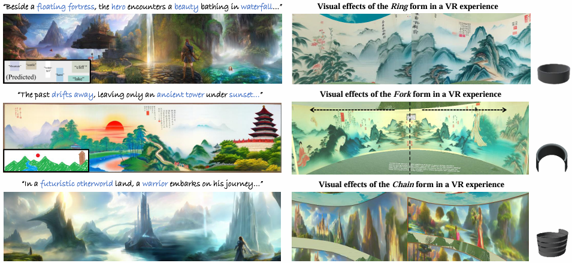

# MagicScroll: Enhancing Immersive Storytelling with Controllable Scroll Image Generation (VR 2025)
## [<a href="https://magicscroll.github.io/" target="_blank">Project Page</a>] [<a href="https://cislab.hkust-gz.edu.cn/publications/magicscroll-enhancing-immersive-storytelling-with-controllable-scroll-image-generation/" target="_blank">Paper</a>]



​					**MagicScroll** is designed to generate coherent, controllable, and engaging scroll images from story texts.

## Abstract

> Scroll images are a unique medium commonly used in virtual reality (VR) providing an immersive visual storytelling experience. Despite rapid advances in diffusion-based image generation, it re mains an open research question to generate scroll images suit able for immersive, coherent, and controllable storytelling in VR. This paper proposes a multi-layered, diffusion-based scroll image generation framework with a novel semantic-aware denoising process. We incorporate layout prediction and style control modules to generate coherent scroll images of any aspect ratio. Based on the scroll image generation framework, we use different multi window strategies to render diverse visual forms such as chains, rings, and forks for VR storytelling. Quantitative and qualitative evaluations demonstrate that our techniques can significantly enhance text-image consistency and visual coherence in scroll image generation, as well as the level of immersion and engagement of VR storytelling. We will release our source code to facilitate better collaborations on immersive storytelling between AI researchers and creative practitioners.

For more see the [project webpage](https://magicscroll.github.io).

## Requirements 
The code has been tested on python 3.8. You can install the required packages via:
```
pip install -r requirements.txt
```
We are also working on a gradio UI and a HuggingFace demo, please stay tuned!

## Citation
```
@inproceedings{wang2025magicscroll,
  title={MagicScroll: Enhancing Immersive Storytelling with Controllable Scroll Image Generation},
  author={Wang, Bingyuan and Meng, Hengyu and Cao, Rui and Cai, Zeyu and Li, Lanjiong and Ma, Yue and Chen, Qifeng and Wang, Zeyu},
  booktitle={2025 IEEE Conference Virtual Reality and 3D User Interfaces (VR)},
  year={2025},
  organization={IEEE}
}
```
